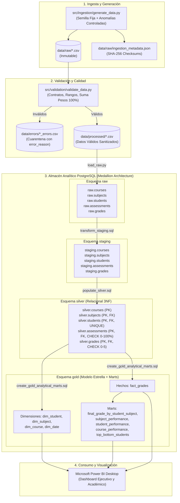
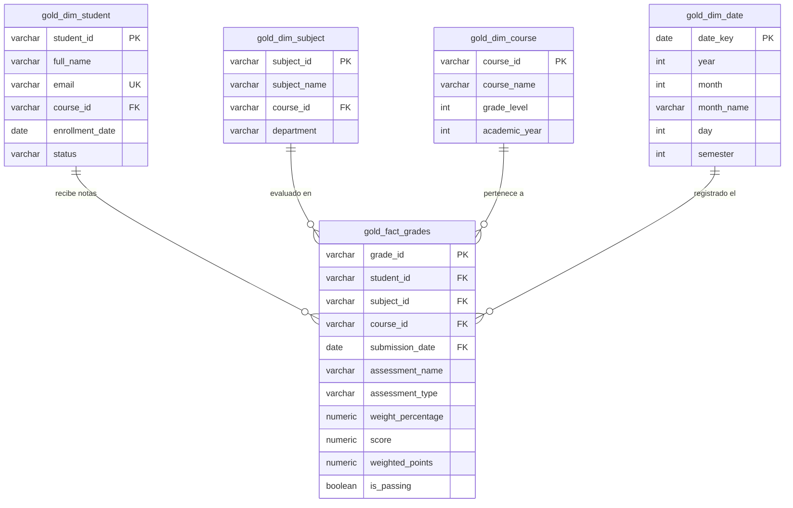

# 🎓 School Grades Data Pipeline (Medallion Architecture)
> **Pipeline de Ingeniería de Datos End-to-End para el Sistema de Calificaciones y Rendimiento Académico Escolar**

[](https://www.python.org/)
[](https://www.postgresql.org/)
[](https://airflow.apache.org/)
[](https://pytest.org/)
[-orange.svg)](#arquitectura-de-datos)

---

## 📌 Resumen del Proyecto
Este proyecto implementa una solución completa y profesional de **Ingeniería de Datos** orientada a la toma de decisiones pedagógicas y académicas en una institución educativa. 

A partir de datos transaccionales de estudiantes, cursos, asignaturas, planes de evaluación con ponderaciones porcentuales y calificaciones en escala de **0.0 a 5.0** (aprobación $\ge 3.0$), el pipeline ingesta, valida, normaliza y modela la información a través de una arquitectura **Medallion en PostgreSQL**, culminando en un **Modelo Estrella (Star Schema)** y marts analíticos listos para su consumo en **Power BI**.

---

## 🏗️ Arquitectura de Datos y Flujo de Trabajo

### Diagrama de Flujo del Pipeline (End-to-End)



---

## 🌟 Modelo Estrella de Datos (Gold Star Schema)



---

## 🛠️ Stack Tecnológico y Decisiones de Diseño

* **Python 3.10+**: Lenguaje base para scripts modulares de ingesta, validación y utilitarios.
* **PostgreSQL (16 / 18)**: Base de datos relacional y analítica donde residen los 4 esquemas Medallion.
* **SQL (DDL y DML Avanzado)**: Transformaciones idempotentes con CTEs, `WINDOW FUNCTIONS`, `ROW_NUMBER()`, `DENSE_RANK()`, `UPSERT` (`ON CONFLICT DO UPDATE`) y constraints.
* **Pandas & NumPy**: Procesamiento tabular, cálculo matricial y validación de reglas de datos.
* **Pytest**: Suite de 16 pruebas automatizadas de integridad referencial, consistencia matemática y contratos de datos.
* **Apache Airflow**: Orquestador de DAGs con dependencias lineales, políticas de retry y timeouts.
* **Docker & Docker Compose**: Despliegue reproducible y aislado de PostgreSQL y Airflow.
* **Git**: Control de versiones estructurado por etapas de desarrollo.

> 💡 **Decisión de Diseño (Sin sobreingeniería)**: No se utilizan herramientas pesadas como Spark, Kafka, Kubernetes o dbt. El volumen del colegio (cientos a miles de registros) es procesado de manera óptima, ultra rápida (< 8 segundos) y con costos de infraestructura mínimos mediante SQL nativo en PostgreSQL y Python estándar.

---

## 📂 Estructura del Repositorio

```text
├── config/                     # Configuraciones generales
├── dags/
│   └── school_grades_dag.py    # DAG de orquestación en Apache Airflow
├── data/
│   ├── raw/                    # Archivos CSV inmutables + metadata.json
│   ├── processed/              # Datos limpios listos para cargar
│   └── errors/                 # Cuarentena de registros con error_reason
├── docker/
│   └── init-databases.sh       # Script de inicio para bases de datos en Docker
├── docs/
│   ├── data_dictionary.md      # Diccionario de datos inspeccionado
│   └── dashboard.md            # Especificación completa de Power BI
├── logs/
│   └── pipeline.log            # Logs estructurados con timestamp y nivel
├── notebooks/
│   └── 01_exploration.ipynb    # Notebook de exploración de datos (EDA)
├── scripts/
│   ├── init_db.py              # Creación de base de datos y esquemas
│   ├── inspect_data.py         # Perfilado e inspección de datasets raw
│   └── run_pipeline.py         # Runner autónomo del pipeline end-to-end
├── sql/
│   ├── raw/                    # DDL de tablas raw (tipos TEXT + auditoría)
│   ├── staging/                # DDL y transformaciones de staging
│   ├── silver/                 # DDL relacional con PK/FK/CHECK + upsert
│   └── gold/                   # DDL Modelo estrella + Marts analíticos
├── src/
│   ├── ingestion/
│   │   └── generate_data.py    # Generador de datos sintéticos reproducibles
│   ├── loading/
│   │   └── load_raw.py         # Cargador idempotente a PostgreSQL raw
│   ├── transformation/
│   │   ├── transform_staging.py # Ejecutor de transformaciones a staging
│   │   ├── transform_silver.py  # Ejecutor de capa relacional silver
│   │   └── transform_gold.py    # Ejecutor de modelo estrella y marts gold
│   ├── utils/
│   │   ├── config.py           # Gestión centralizada de variables de entorno
│   │   ├── db.py               # Conexión, transacciones y ejecución SQL
│   │   ├── hashing.py          # Cálculo de checksums SHA-256
│   │   └── logger.py           # Logger formateado a consola y archivo
│   └── validation/
│       └── validate_data.py    # Validador de calidad y regla suma 100%
├── tests/
│   ├── test_database_integrity.py # Pruebas de PKs, FKs y constraints en Postgres
│   ├── test_gold_metrics.py       # Pruebas de identidades matemáticas y marts
│   └── test_raw_validation.py     # Pruebas de archivos raw, columnas y cuarentena
├── .env.example                # Plantilla de variables de entorno segura
├── .gitignore                  # Exclusión de credenciales, cachés y logs
├── docker-compose.yml          # Orquestación de contenedores (Postgres + Airflow)
├── requirements.txt            # Dependencias del proyecto
└── README.md                   # Documentación principal
```

---

## 🚀 Guía de Instalación y Ejecución Paso a Paso

### 1. Clonar el Repositorio y Configurar Entorno
```bash
git clone <URL_DEL_REPOSITORIO>
cd arquitectura
```

### 2. Crear y Activar Entorno Virtual
```bash
# Windows
python -m venv venv
.\venv\Scripts\activate

# Linux / macOS
python3 -m venv venv
source venv/bin/activate
```

### 3. Instalar Dependencias
```bash
pip install -r requirements.txt
```

### 4. Configurar Variables de Entorno
Copia la plantilla `.env.example` a `.env` y ajusta tus credenciales de PostgreSQL:
```bash
cp .env.example .env
```
Contenido de `.env`:
```ini
POSTGRES_HOST=localhost
POSTGRES_PORT=5432
POSTGRES_DB=school_dw
POSTGRES_USER=postgres
POSTGRES_PASSWORD=tu_contraseña_aqui
RANDOM_SEED=42
LOG_LEVEL=INFO
```

---

### 5. Ejecución del Pipeline

Tienes **dos opciones** de ejecución según tu entorno:

#### Opción A: Ejecución Local Autónoma (Recomendada y Ultrarrápida)
Ejecuta todo el flujo secuencial en ~8 segundos mediante el runner autónomo:
```bash
python scripts/run_pipeline.py
```

O puedes ejecutar cada etapa de forma individual y modular:
```bash
# 1. Inicializar la base de datos y esquemas en PostgreSQL
python scripts/init_db.py

# 2. Generar datos sintéticos reproducibles en data/raw/
python src/ingestion/generate_data.py

# 3. Inspeccionar el dataset y actualizar el diccionario de datos
python scripts/inspect_data.py

# 4. Validar calidad de datos y aislar anomalías en data/errors/
python src/validation/validate_data.py

# 5. Cargar datos raw a PostgreSQL (esquema raw)
python src/loading/load_raw.py

# 6. Transformar y limpiar hacia el esquema staging
python src/transformation/transform_staging.py

# 7. Modelar y construir la capa relacional silver
python src/transformation/transform_silver.py

# 8. Construir el modelo estrella y marts analíticos en gold
python src/transformation/transform_gold.py

# 9. Ejecutar la suite completa de pruebas de calidad
pytest -v
```

#### Opción B: Despliegue con Docker y Apache Airflow
Si tienes Docker Desktop instalado:
```bash
# Iniciar servicios de PostgreSQL y Apache Airflow
docker compose up -d

# Acceder a la interfaz web de Airflow en http://localhost:8080
# Usuario: admin | Contraseña: admin
```
Activa y ejecuta el DAG `school_grades_data_pipeline` en la interfaz web de Airflow.

---

## 🔍 Reglas de Validación de Calidad y Cuarentena

El módulo `src/validation/validate_data.py` audita cada registro antes de permitir su ingreso a la base de datos de producción:

| Regla de Validación | Condición Evaluada | Acción si es Inválido |
| :--- | :--- | :--- |
| **Presencia de Esquema** | Archivos y columnas obligatorias existen | Aborta el pipeline con alerta crítica |
| **Campos Obligatorios** | `student_id`, `score`, `weight_percentage`, etc. no nulos | Cuarentena a `data/errors/` con motivo |
| **Rango de Notas** | `0.0 <= score <= 5.0` (Aprobación $\ge 3.0$) | Cuarentena (`Grade score X out of allowed scale`) |
| **Rango de Ponderación** | `0.0 <= weight_percentage <= 100.0` | Cuarentena (`Weight percentage out of range`) |
| **Suma de Pesos por Materia**| **$\sum \text{weight\_percentage} = 100.0\%$ por materia** | Cuarentena del plan de evaluación completo |
| **Unicidad de Llaves** | Sin duplicados en `PK` ni `(assessment_id, student_id)` | Cuarentena del duplicado con motivo |
| **Integridad Referencial** | Estudiante y Evaluación existen en catálogo base | Cuarentena (`Foreign key violation`) |
| **Formato de Fechas** | Fechas cumplen estándar ISO `YYYY-MM-DD` | Cuarentena (`Invalid date format`) |

> 🛡️ **Principio de Inmutabilidad**: Los archivos en `data/raw/` **nunca se modifican ni se borran**. Los errores se aíslan en `data/errors/<entidad>_errors.csv` agregando la columna `error_reason`.

---

## 🧪 Pruebas Automatizadas con Pytest

La suite incluye 16 pruebas unitarias y de integración que se ejecutan automáticamente en el pipeline:

```text
tests/test_database_integrity.py::test_database_connection_and_schemas PASSED
tests/test_database_integrity.py::test_no_duplicate_pks_in_silver PASSED
tests/test_database_integrity.py::test_no_unexpected_nulls_in_silver_mandatory_fields PASSED
tests/test_database_integrity.py::test_silver_grade_scores_within_range PASSED
tests/test_database_integrity.py::test_silver_assessment_weights_within_range PASSED
tests/test_gold_metrics.py::test_gold_tables_not_empty PASSED
tests/test_gold_metrics.py::test_assessment_weights_sum_to_100_in_gold PASSED
tests/test_gold_metrics.py::test_recalculated_final_grade_equals_gold_final_grade PASSED
tests/test_gold_metrics.py::test_subject_performance_pass_plus_fail_rates_equal_100 PASSED
tests/test_gold_metrics.py::test_course_performance_pass_plus_fail_rates_equal_100 PASSED
tests/test_gold_metrics.py::test_student_gpa_within_bounds PASSED
tests/test_raw_validation.py::test_raw_files_and_metadata_exist PASSED
tests/test_raw_validation.py::test_expected_columns_in_raw_data PASSED
tests/test_raw_validation.py::test_error_quarantine_has_reasons PASSED
tests/test_raw_validation.py::test_processed_grades_in_valid_range PASSED
tests/test_raw_validation.py::test_processed_assessments_weights_sum_to_100 PASSED
============================= 16 passed in 2.89s =============================
```

### Invariantes Matemáticos Verificados
1. **Ponderación Exacta**: $\sum \text{peso} = 100.00\%$ para cada materia en la capa analítica.
2. **Reconciliación de Notas Finales**: $\text{final\_grade} = \sum (\text{nota} \times \text{peso}/100)$ recalculada coincide con el valor almacenado en `gold.final_grade_by_student_subject`.
3. **Consistencia de Tasas**: $\% \text{ Aprobados} + \% \text{ Reprobados} = 100.00\%$ en todas las tablas agregadas.

---

## 📊 Tablas y Marts en la Capa Gold (Power BI Ready)

| Tabla / Mart en `gold` | Tipo | Grano / Descripción |
| :--- | :--- | :--- |
| `dim_student` | Dimensión | Alumno matriculado, datos demográficos y curso. |
| `dim_subject` | Dimensión | Asignatura y departamento académico. |
| `dim_course` | Dimensión | Cohorte, grado y año académico. |
| `dim_date` | Dimensión | Calendario por fecha de entrega, trimestre y semestre. |
| `fact_grades` | Hecho | Calificación individual con puntos ponderados aportados. |
| `final_grade_by_student_subject` | Mart Analítico | Nota definitiva ponderada por alumno y materia con estado Aprobado/Reprobado. |
| `subject_performance` | Mart Analítico | Promedio por materia, total matriculados, % aprobados y % reprobados. |
| `student_performance` | Mart Analítico | Promedio general (GPA), materias aprobadas/reprobadas y rankings. |
| `course_performance` | Mart Analítico | Desempeño comparativo entre salones y grados. |
| `assessment_type_performance` | Mart Analítico | Rendimiento comparativo por tipo de prueba (Parcial vs Taller vs Quiz). |
| `top_bottom_students` | Mart Analítico | Cuadro de honor (Top 5) y plan de refuerzo (Bottom 5). |
| `subjects_highest_failure` | Mart Analítico | Ranking de materias con mayor índice de pérdida académica. |

---

## 🛠️ Troubleshooting y Preguntas Frecuentes

### 1. ¿Cómo se garantiza la idempotencia si el pipeline se ejecuta varias veces?
* En la capa `raw`, se realiza un `TRUNCATE` de la tabla antes de cargar el nuevo lote de archivos, evitando duplicaciones.
* En `staging`, se realiza un `TRUNCATE` y reconstrucción controlada con deduplicación por ventana `ROW_NUMBER()`.
* En `silver`, se utiliza la sentencia `ON CONFLICT (PK) DO UPDATE` (patrón UPSERT), preservando la integridad y actualizando el `updated_at`.
* En `gold`, las dimensiones y hechos se reconstruyen de manera atómica dentro de transacciones SQL.

### 2. Error: Conexión rechazada a PostgreSQL en el puerto 5432
* Verifica que el servicio de PostgreSQL esté en ejecución:
  ```powershell
  Get-Service *postgres*
  ```
* Confirma que las credenciales en tu archivo `.env` coincidan con el usuario `postgres`.

### 3. ¿Dónde consultar los registros rechazados por calidad?
* En la carpeta `data/errors/`. Cada archivo tiene la columna `error_reason` explicando la causa exacta (ej. `Grade score 6.8 out of allowed scale [0.0 - 5.0]`, `Subject assessment weights sum to 115.0%, expected 100.0%`).

---

## 👤 Autor y Contacto
* **Ingeniero de Datos**: Junior/Mid Data Engineer
* **Propósito**: Proyecto de Portafolio Profesional en Arquitectura y Calidad de Datos
